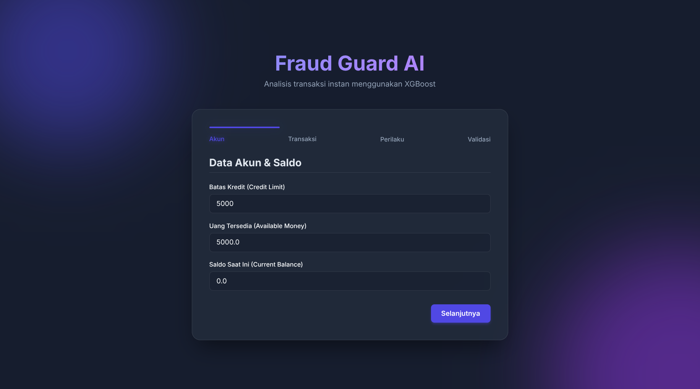
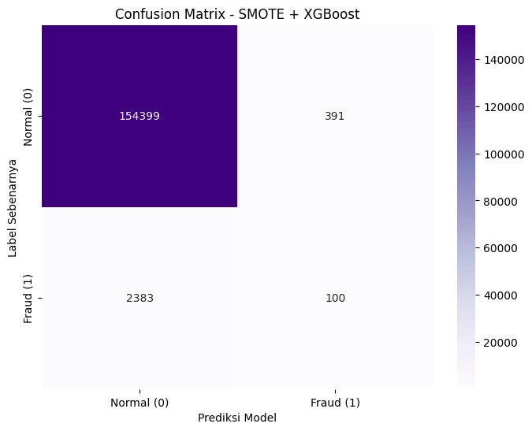

# 🛡️ Fraud Guard AI

> Sistem deteksi penipuan transaksi kartu kredit secara real-time menggunakan model **XGBoost** dengan antarmuka web modern berbasis Flask.

---

## 🖥️ Tampilan Aplikasi Web



Aplikasi web multi-step yang memungkinkan pengguna memasukkan 21 fitur transaksi secara terstruktur, lalu mendapatkan prediksi **Fraud** atau **Aman** beserta skor probabilitas secara instan.

---

## 📦 Dataset

Dataset yang digunakan berasal dari Kaggle:

> 🔗 **[Fraud Detection Dataset — Kaggle](https://www.kaggle.com/datasets/iabhishekbhardwaj/fraud-detection)**

| Atribut | Detail |
|---|---|
| **Sumber** | Kaggle — iabhishekbhardwaj |
| **Jumlah Baris** | 786.363 transaksi |
| **Jumlah Kolom** | 29 fitur |
| **Tipe Data** | Campuran (numerik, teks, boolean) |
| **Label Target** | `isFraud` (True/False) |
| **Distribusi Label** | ~98.42% Normal, ~1.58% Fraud (sangat imbalanced) |

---

## 📊 Performa Model

Model XGBoost dilatih menggunakan dataset transaksi kartu kredit dengan **786.363 baris data** dan tingkat penipuan sebesar ~1.58% (imbalanced class).

### Confusion Matrix



Model menggunakan SMOTE + XGBoost untuk menangani ketidakseimbangan kelas. Hasil pada data uji menunjukkan kemampuan yang baik dalam mendeteksi transaksi penipuan.

| | Prediksi Normal | Prediksi Fraud |
|---|---|---|
| **Label Normal** | 154,399 | 391 |
| **Label Fraud** | 2,383 | 100 |

### Precision-Recall vs Threshold


Kurva ini digunakan untuk memilih threshold probabilitas yang optimal sesuai kebutuhan bisnis — apakah lebih mengutamakan **Recall** (menangkap lebih banyak penipuan) atau **Precision** (mengurangi alarm palsu).

### Feature Importance


Fitur paling berpengaruh dalam prediksi model:
1. **`cardPresent`** — Apakah kartu fisik hadir saat transaksi (~33%)
2. **`posEntryMode`** — Mode entri pada terminal POS (~14%)
3. **`transactionAmount`** — Nominal transaksi (~10%)
4. **`creditLimit`** — Batas kredit akun (~8%)
5. **`merchantCategoryCode`** — Kategori merchant (~7%)

---

## 📁 Struktur Proyek

```
web/
├── app.py                    # Backend server Flask
├── requirements.txt          # Daftar dependensi Python
├── fraud.ipynb               # Notebook pelatihan model (Google Colab)
├── xgboost_fraud_model.json  # Model XGBoost yang sudah dilatih
├── expected_features.joblib  # Daftar urutan fitur yang diharapkan model
├── label_encoder.joblib      # Label encoder untuk kolom kategorikal
├── assets/
│   ├── tampilanWeb.png       # Screenshot tampilan aplikasi web
│   ├── confusionMatris.png   # Visualisasi confusion matrix model
│   ├── Precision Recall.png  # Kurva Precision-Recall vs Threshold
│   └── Feature Importance.png# Grafik kepentingan fitur model
├── templates/
│   └── index.html            # Halaman UI (HTML)
├── static/
│   ├── style.css             # Styling CSS (Glassmorphism dark theme)
│   └── script.js             # Logika frontend (multi-step form + fetch API)
└── venv/                     # Virtual environment Python
```

---

## 🚀 Cara Menjalankan

### 1. Clone & Masuk ke Direktori

```bash
cd web/
```

### 2. Aktifkan Virtual Environment & Install Dependensi

```bash
python3 -m venv venv
source venv/bin/activate   # Linux/macOS
# venv\Scripts\activate    # Windows

pip install -r requirements.txt
```

### 3. Jalankan Server Flask

```bash
python app.py
```

### 4. Buka di Browser

```
http://localhost:5050
```

---

## ⚙️ Fitur Input Model (21 Fitur)

| Kelompok | Fitur |
|---|---|
| **Akun** | `creditLimit`, `availableMoney`, `currentBalance` |
| **Transaksi** | `transactionAmount`, `merchantName`, `transactionType`, `merchantCategoryCode`, `acqCountry`, `merchantCountryCode` |
| **Histori** | `trx_count_24h`, `trx_sum_24h`, `trx_sum_7d`, `avg_daily_spend_7d`, `amount_vs_7d_avg` |
| **Waktu** | `transactionHour`, `transactionDayOfWeek` |
| **POS & Kartu** | `posEntryMode`, `posConditionCode`, `cardPresent`, `cvvMatch`, `expirationDateKeyInMatch` |

---

## 🛠️ Tech Stack

| Layer | Teknologi |
|---|---|
| **Model ML** | XGBoost, Scikit-learn, Pandas, NumPy |
| **Backend** | Python, Flask |
| **Frontend** | HTML5, Vanilla CSS (Glassmorphism), JavaScript (Fetch API) |
| **Font** | Google Fonts - Inter |

---

## ⚠️ Catatan

> Model ini dibuat untuk tujuan demonstrasi dan pembelajaran. Akurasi prediksi untuk fitur bertipe teks (kategorikal) seperti `merchantName` mungkin kurang optimal karena keterbatasan penyimpanan `LabelEncoder` pada tahap pelatihan awal. Untuk produksi, disarankan melatih ulang model dengan `OrdinalEncoder` yang menyimpan mapping per kolom secara terpisah.
